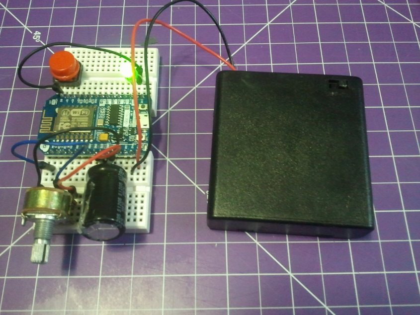
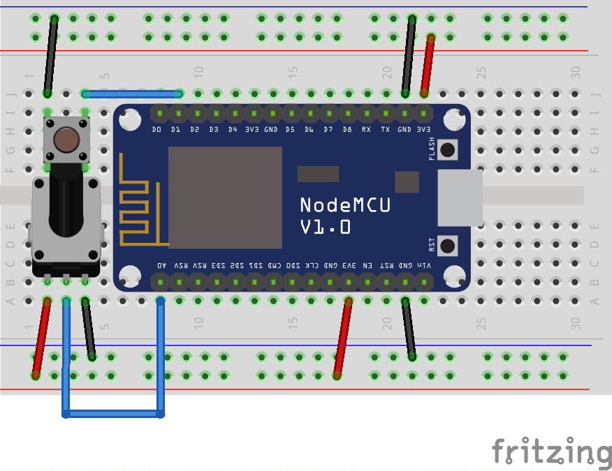

# KSP-ESP8266
Using an ESP8266 and Telemachus to create a WiFi Kerbal controller.  I'm mostly focussing on buttons here, since tablets work great for display.

## Dependencies
* I'm using a [Node MCU devkit](http://www.seeedstudio.com/depot/NodeMCU-v2-Lua-based-ESP8266-development-kit-p-2415.html) v0.9, but any ESP8266 would probably work as long as you have access to all the pins (more than 8). 
* I'm programming it in the [Arduino core for ESP8266 WiFi chip](https://github.com/esp8266/Arduino)
* and using this [Websocket](https://github.com/morrissinger/ESP8266-Websocket) library
* https://github.com/tzapu/WiFiManager
* [Telemachus](https://github.com/richardbunt/Telemachus)

## Getting Started
1. Start with [KSP](http://kerbalspaceprogram.com) and [Telemachus](https://github.com/richardbunt/Telemachus), make sure they work.
2. Get yourself a [devkit](http://www.seeedstudio.com/depot/NodeMCU-v2-Lua-based-ESP8266-development-kit-p-2415.html)
2. Install [Arduino core](https://github.com/esp8266/Arduino), and make sure you can program the ESP8266 using the simple examples that come with it.
3. Wire it up

4. Take this project & upload it.  You can just use the compiled binary if you do not feel like messing around with dependencies.

## Use
If it is not on your WiFi, it will create its own.  Connect to it, and set your WiFi details.  Then it will join your WiFi network.
Connect to the ESP8266 using your browser and specify the target IP in the form.
It takes 5-10 seconds from power on to connection.

This example uses a button between ground and GPIO5 (Pin 1) which will stage, and a potentiometer on A0 which controls the throttle.  The blue LED (Pin 2) will be on when connected to Telemachus.

Enable DEBUG to get status messages over the serial connection

It probably depends on your computer, but for me the lag is almost a second.
